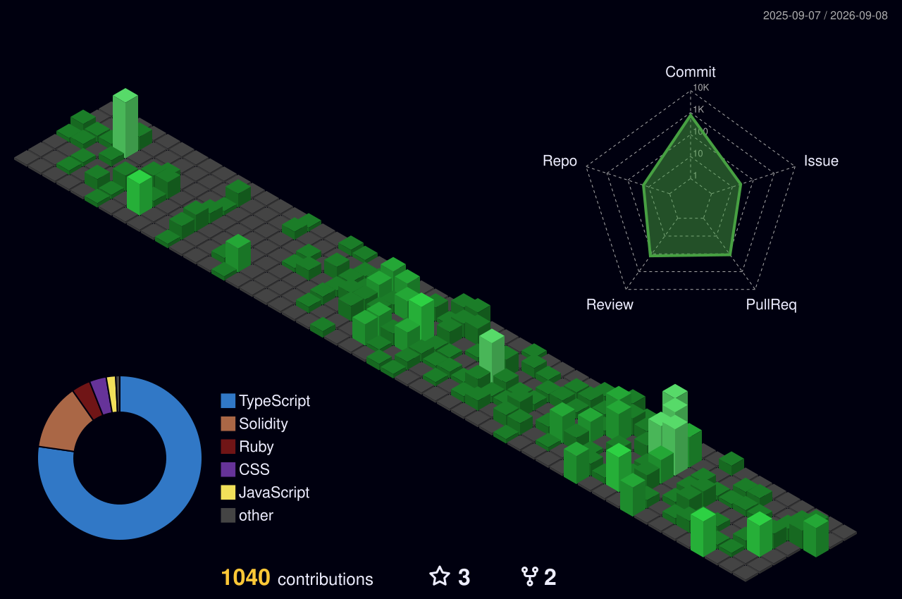

### Certified Hedera Developer. Blockchain engineer. Open-source contributor.
I'm Jessy Ssebuliba, an open source developer based in Kampala, Uganda. I'm an active contributor and maintainer at Hiero ledger, and I've been building across the open source world through OpenMRS, Eclipse Adoptium, and Open Data Ensemble.
I'm a member of Support and Care Africa, which provides support for the open source community, and a Hedera Ambassador. I focus on blockchain systems, applied cryptography, and zero-knowledge proofs and my work neatly revolves around those!

Let's connect 👋

  

